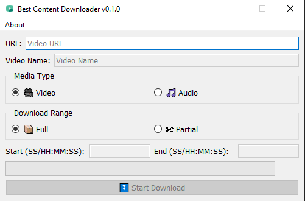

# Best Content Downloader
A multi-platform content downloader GUI. Best Content Downloader is completely open source and also multi-platform content downloader. It is developed with Python. It used some libraries as Qt and yt-dlp. You can copy-paste URL of any videos or audios from supported websites.

# Screenshot

## Download the latest executable version
- 🟢 **[Latest Release](http://github.com/kurtulusakinim/Best-Content-Downloader/releases/latest)**

# Features
- Download videos from supported websites
- Download only audios
- Selectable download range (Full or Partial)
- Changable content file name

# Usage
1. Move .exe to somewhere
2. Add ffmpeg to path or the folder containin the .exe
3. Run .exe
